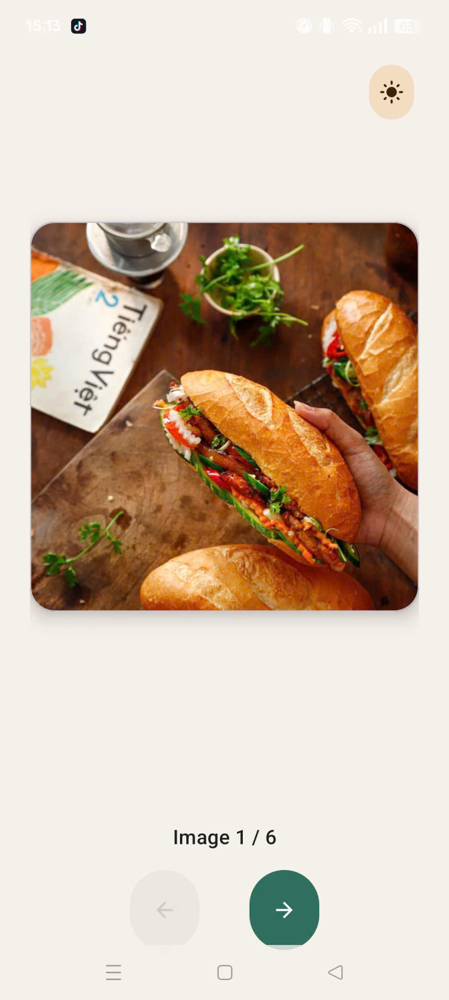
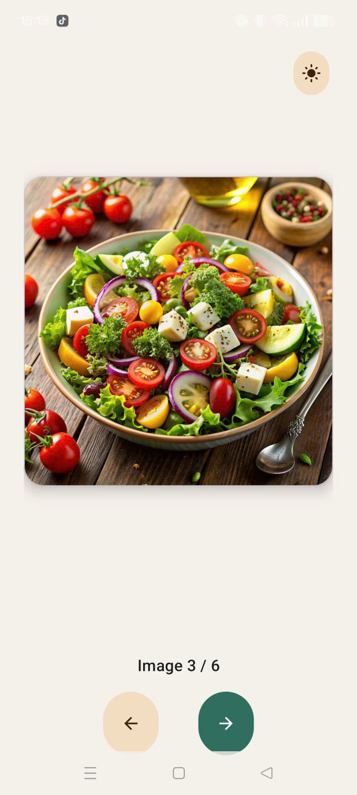
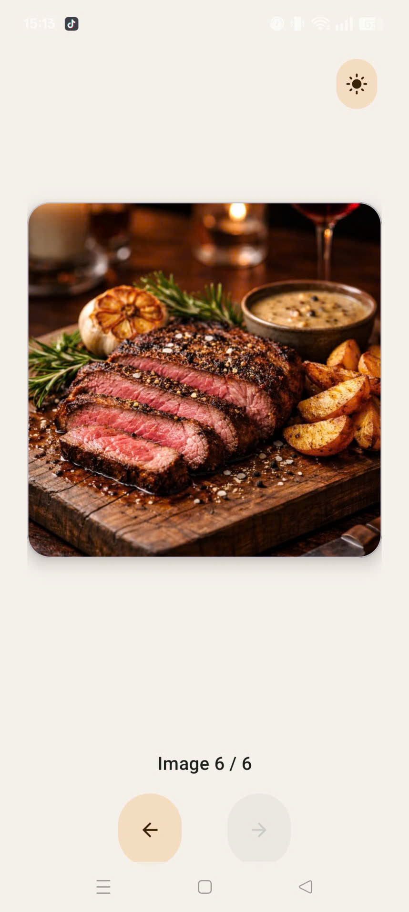
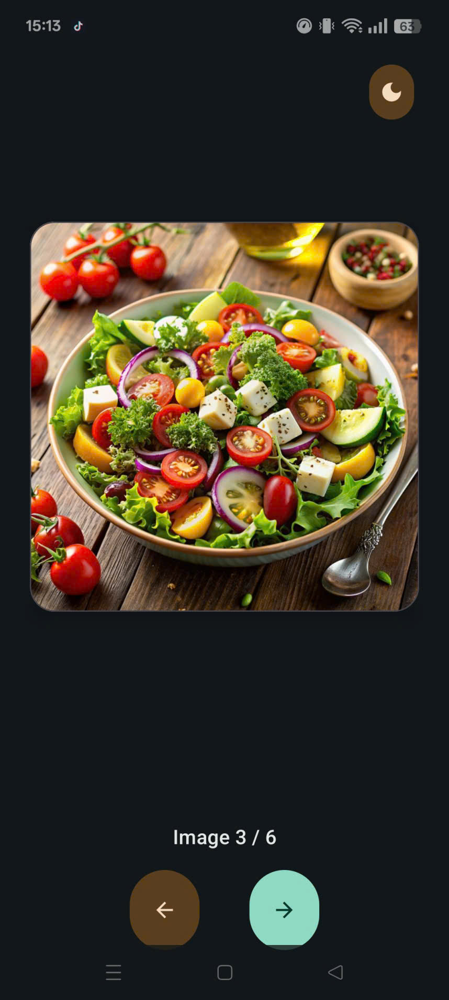

# Whisk Pics

A native Android image viewer built with Kotlin and View-based UI (XML layouts + ViewBinding). It displays one photo at a time from a fixed local collection, with icon-based Back/Next navigation, a position indicator, a crossfade transition between images, and a manual light/dark theme toggle.

Built as coursework for **COMP1786 — Exercise 2: "Create an Android App allowing users to view images."**

## Screenshots

| Light mode — first image | Light mode — middle | Light mode — last image |
|---|---|---|
|  |  |  |

| Dark mode | Theme toggle |
|---|---|
|  |  |
## Features

- **Single-image viewer** — one photo shown at a time in a rounded, elevated card
- **Back / Next navigation** — icon-only Material buttons, no wraparound
- **Boundary handling** — Back is disabled and dimmed on the first image, Next is disabled and dimmed on the last image; repeated tapping at either end never crashes or silently loops
- **Position indicator** — a live "Image X / N" label below the image
- **Crossfade animation** — a fade-out/fade-in transition plays on every image change instead of an instant swap
- **Light & dark theme** — a custom Material 3 color palette with a dedicated dark-mode variant (`values-night`)
- **Manual theme toggle** — a sun/moon icon button lets the user override the system theme from inside the app; the choice is persisted with `SharedPreferences` and survives app restarts, applied before the UI renders (no flash of the wrong theme). The current image index is preserved across the theme-triggered activity recreation.

## Tech stack

- **Kotlin**
- **ViewBinding** (no `findViewById`)
- **AndroidX**: AppCompat, ConstraintLayout, Core-KTX, Lifecycle-Runtime-KTX
- **Material Components for Android** (Material 3 theming, `MaterialCardView`, `MaterialButton`)
- No third-party image-loading or navigation libraries — images are local drawable resources, navigation is plain Kotlin state

## Building and running

1. Open the project root in Android Studio.
2. Let Gradle sync (no extra setup required — no API keys, no additional SDKs).
3. Run the `app` configuration on an emulator or device with API 24+.

Or from the command line:

```bash
./gradlew assembleDebug
```

## Project structure

```
app/src/main/java/com/example/whiskpics/
└── MainActivity.kt              # Navigation, boundary logic, theme toggle, image rendering

app/src/main/res/
├── layout/activity_main.xml     # Image card, position label, nav buttons, theme toggle
├── values/colors.xml            # Light theme palette
├── values/themes.xml            # Material3 DayNight theme
├── values-night/colors.xml      # Dark theme palette (same color names, dark values)
├── values-night/themes.xml      # Dark theme declaration (explicit, mirrors values/themes.xml)
├── drawable/ic_arrow_back.xml   # Back button icon
├── drawable/ic_arrow_forward.xml# Next button icon
├── drawable/ic_theme_sun.xml    # Light-mode toggle icon
├── drawable/ic_theme_moon.xml   # Dark-mode toggle icon
├── drawable/photo_*.jpg         # The six viewable images
└── anim/fade_in.xml, fade_out.xml # Crossfade transition
```

## Navigation logic

Image transitions are handled by small, single-purpose functions in `MainActivity.kt`:

- `showNextImage()` / `showPreviousImage()` — move the index and trigger a refresh
- `displayImage()` — renders the current image, animating the transition when requested
- `updateButtonStates()` — enables/disables and dims Back/Next at the list boundaries
- `updatePositionIndicator()` — keeps the "Image X / N" label in sync
- `toggleThemeMode()` / `applyPersistedThemeMode()` — flip and persist the light/dark override
